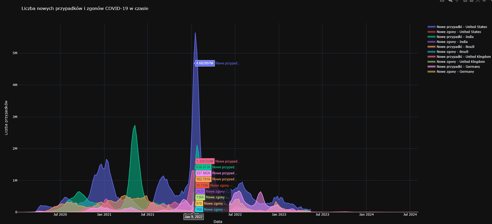
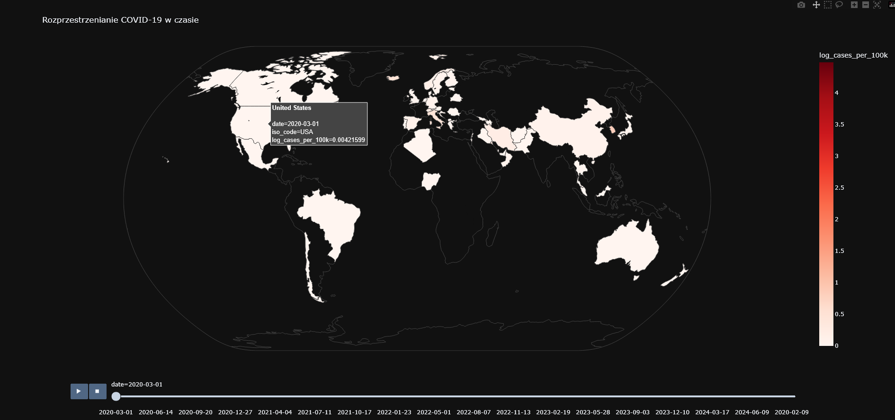
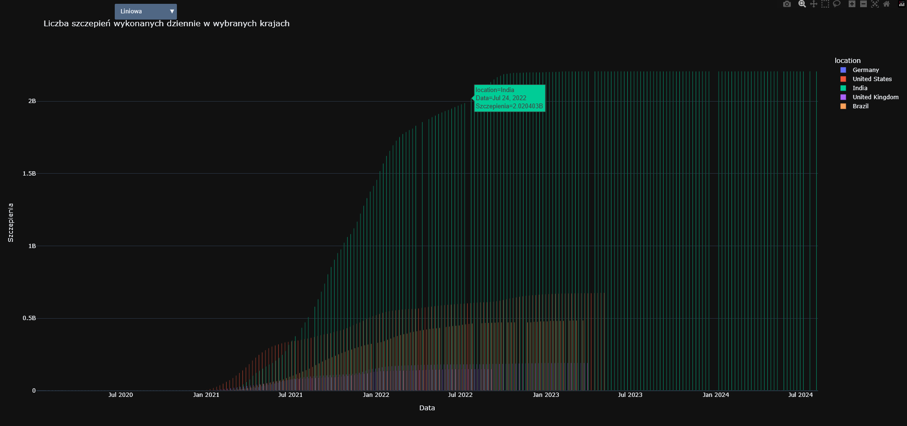
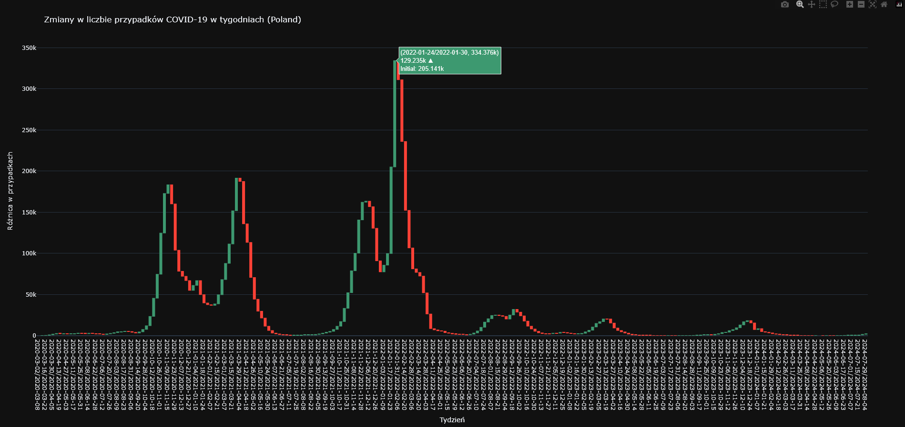
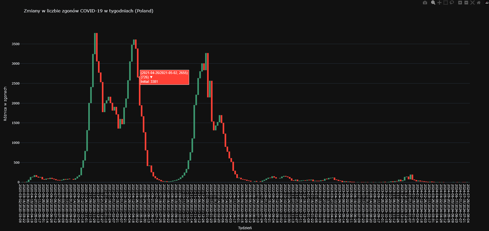
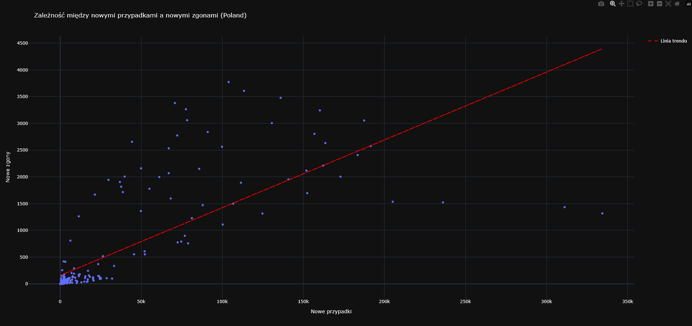

# Zadania z wizualizacji danych

## Opis

Repozytorium zawiera zadania wykonane podczas zajęć z wizualizacji danych. Wykorzystano bibliotekę Plotly do tworzenia
interaktywnych wykresów.

## Przykłady wizualizacji

Poniżej przedstawiono przykłady wykresów stworzonych przy pomocy biblioteki Plotly:

## Wykorzystane technologie

- Python
- Plotly
- Pandas
- NumPy

## Autor

Dawid Kapciak

## Data wykonania

27.02.2025 r.
